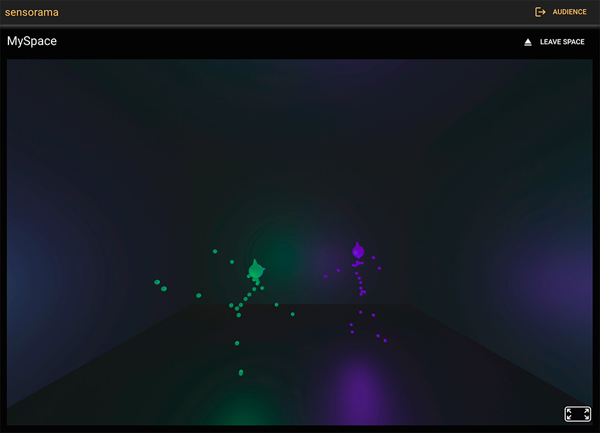
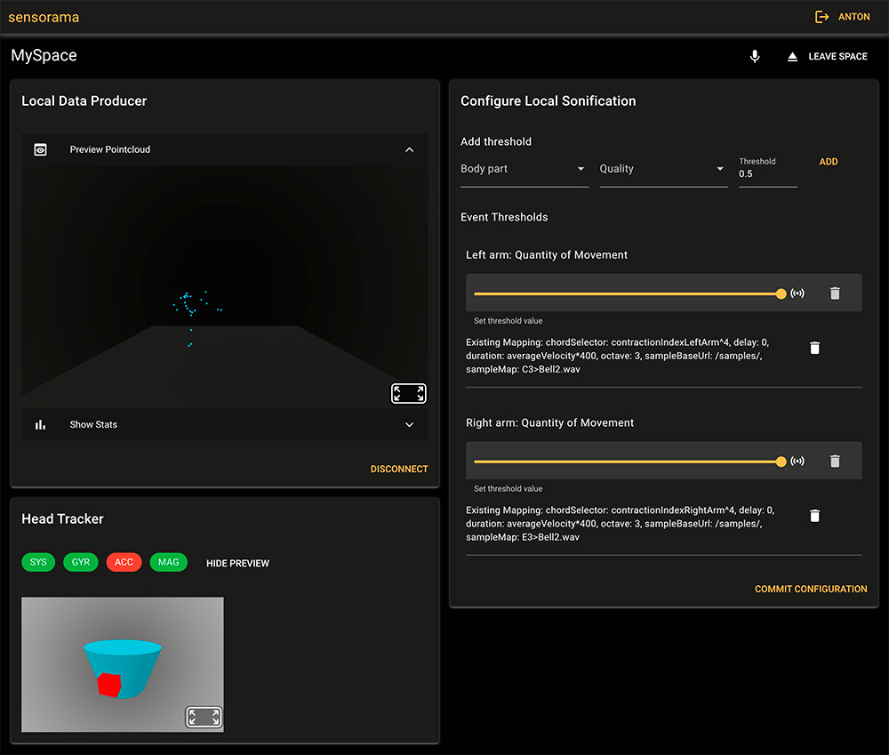

## Abschlussarbeit von Anton Koch

> im berufsbegleitenden Masterstudiengang Geoinformatik

|                      |                                                                            |
|----------------------|----------------------------------------------------------------------------|
| Thema                | Sensorama: A task-specific Telepresence Application for Contemporary Dance |
| Betreuer             | Prof. Dr. Pascal Neis                                                      |
| Bearbeitungszeitraum | 15.08.203 bis 14.02.2024                                                   |

### Ausgangslage

Spezialisierte Telepräsenzanwendungen wie in Telemedizin und Industrie sind für kleinere Projekte in Kunst und Kultur 
unerschwinglich und allgemeine Videokonferenzanwendungen erfüllen nicht die Anforderungen einer sich an Körper und
Raum orientierenden Praxis. Unterschiedliche Formen des Tanzes benötigen jeweils spezielle Ein- und Ausgabemedien, um
Bewegung und Präsenz adäquat vermitteln zu können.

Die zahlreichen freien Open-Source Bibliotheken und Webstandards ermöglichen einen niederschwelligen Zugang zum „Rapid
Prototyping“ im Browser. Bewegungserfassung, Echtzeitkommunikation, Mixed-Reality, räumliche Klangsynthese und vieles
mehr können ohne Verwendung proprietärer Lizenzen in Webanwendungen integriert werden.

### Zielsetzung

Diese Studie untersuchte die Machbarkeit der Entwicklung einer aufgabenspezifischen Telepräsenzanwendung für den
Einsatz im zeitgenössischen Tanz und basierend auf offenen Standards. Dazu wurde eine virtuelle Umgebung geschaffen, in
der zwei professionelle Tänzer:innen an entfernten Orten nur über
die räumliche Ortung ihrer Stimmen und die Sonifikation ihrer Bewegung miteinander tanzen können. Der Fokus lag dabei
auf der generellen Machbarkeit einer solchen Umsetzung.

### Ergebnisse der Arbeit

Die Praktikabilität und technologischen Möglichkeiten einer fallspezifischen
Softwareimplementierung als Teil interdisziplinärer Projekte wurden positiv bewertet. Daraus wurde der Begriff des
„Code Composting“ abgeleitet, der sich als Entwicklungsstrategie auf Zyklen intuitiver Komposition und analytischer
Dekomposition bezieht und für kleinere kreative Projekte empfohlen wird.

- Überblick über die gegenwärtige Auswahl an unterstützenden Technologien und Paradigmen
- Referenzimplementierung (in JavaScript, Python und C++)
- Auswertung der abstrakten Funktionalität (Latenz, Last), Code-Qualität, Arbeitszeitinvestition
- Kritische Reflektion & Ausblick

